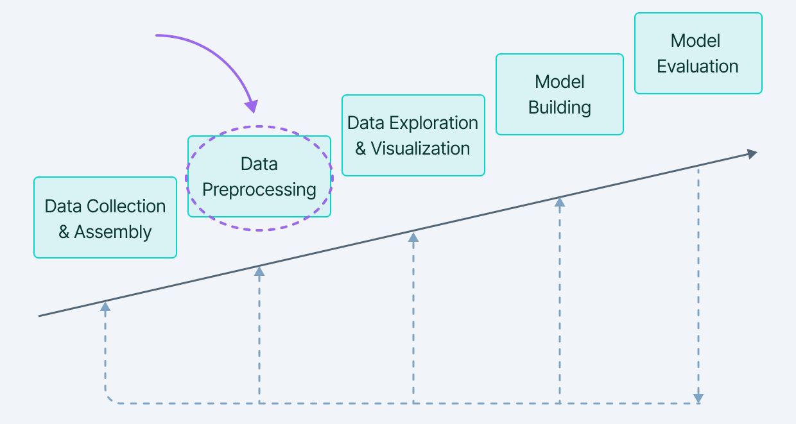

# Data-mining-101
Data mining is the process of discovering patterns and insights in large datasets. It involves using techniques from fields such as machine learning, statistics, and database systems to extract and analyze data. Some common techniques used in data mining include decision trees, clustering, and neural networks. 

## A. Data collection and assembly 
This is the first step in the data mining process, and involve gathering and organizing the data that will be used for analysis. There are several steps involved in this process:
  1. Identify the problem or question that you want to answer with the data. This will help to determine what type of data is needed and where it can be obtained.
  2. Determine the sources of the data. This may include internal company databases, public data sources, or data obtained through surveys or experiments.
  3. Collect the data from the identified sources. This may involve downloading data from online sources, extracting data from databases, or collecting data through surveys or experiments.
  4. Assemble the data into a usable format. This may involve organizing the data into tables or files, or converting it into a format that can be easily analyzed.
  5 Check the quality of the data. This may involve verifying that the data is complete and accurate, and identifying and correcting any errors or inconsistencies.

It is important to carefully plan and execute the data collection and assembly process to ensure that the resulting dataset is reliable and suitable for analysis.

## B. Data pre-processing 
This is the process of preparing raw data for analysis. It is an important step in the data mining process as it can significantly impact the quality and usefulness of the results obtained.
There are several steps involved in data pre-processing, including:
  1. Data cleaning: This involves identifying and correcting errors or inconsistencies in the data. This may involve dealing with missing values, incorrect data types, and outlier values.
  2. Data integration: This involves combining data from multiple sources, such as different databases or files. This can help to ensure that all relevant data is available for analysis.
  3. Data transformation: This involves transforming the data into a format that is more suitable for analysis. This may involve scaling the data, creating new features, or aggregating data into smaller units.
  4. Data reduction: This involves reducing the size of the data by selecting a subset of the data or by using techniques such as dimensionality reduction. This can help to reduce the computational cost of data analysis and improve the performance of machine learning algorithms.

It is important to carefully consider the data pre-processing steps that are necessary for a particular dataset and analysis, as they can significantly impact the quality and usefulness of the results.

## C. Data exploration and visualization 
Data exploration and visualization are important steps in the data mining process as they can help to gain a better understanding of the data and identify patterns and trends.
Data exploration involves examining the data in detail to understand its characteristics and relationships. This may involve calculating summary statistics such as mean, median, and standard deviation, and creating visualizations such as histograms and scatter plots to better understand the data.
Data visualization is the process of creating visual representations of the data, such as charts and graphs, to make it easier to understand and communicate. There are many tools and techniques available for data visualization, including software programs like Excel and Tableau, and programming libraries such as Matplotlib and Seaborn.
Data exploration and visualization can be valuable for identifying patterns and trends in the data, as well as for identifying potential problems or biases in the data that may need to be addressed in the analysis.
  1. Select the data that you want to explore and visualize. This may involve selecting a subset of the data or aggregating the data in some way.
  2. Calculate summary statistics such as mean, median, and standard deviation to gain a better understanding of the data.
  3. Create visualizations such as histograms, scatter plots, and box plots to explore the data and identify patterns and trends.
  4. Use interactive visualizations or data exploration tools to explore the data in more depth and identify relationships and patterns.
  5. Refine the visualizations as needed to better communicate the insights and patterns in the data.
  6. Review the results of the data exploration and visualization to identify any potential issues or biases in the data, and consider how these may impact the analysis.

It is important to carefully plan and execute the data exploration and visualization process to ensure that the resulting insights are reliable and useful.

## D. Building models
Models are mathematical representations of real-world phenomena that can be used to make predictions or decisions. In data mining, models are used to uncover patterns and relationships in data and to make predictions or decisions based on those patterns.
There are many different types of models that can be used in data mining, including:
  1. Linear regression models: These models are used to predict a continuous outcome based on one or more predictor variables.
  2. Logistic regression models: These models are used to predict a binary outcome, such as yes/no or pass/fail.
  3. Decision trees: These models are used to make decisions based on a series of rules.
  4. Neural networks: These models are inspired by the structure and function of the human brain, and are used for tasks such as classification and prediction.
  5. Clustering models: These models are used to group data into clusters based on similar characteristics.
  6. Association rule learning models: These models are used to identify associations or relationships between different items in a dataset.

It is important to carefully evaluate the quality and reliability of the results obtained from data mining models, as the results may be affected by factors such as the quality of the data and the choice of model.

## E. Model evaluation 
It is the process of assessing the performance of a model and determining its usefulness for a particular task. There are several steps involved in model evaluation, including:
  1. Divide the dataset into a training set and a testing set. The training set is used to build the model, while the testing set is used to evaluate the model's performance.
  2. Train the model on the training set. This involves fitting the model to the data and adjusting the model's parameters to optimize its performance.
  3. Test the model on the testing set. This involves using the model to make predictions on the testing set and comparing the predictions to the actual values.
  4. Calculate performance metrics. This may include metrics such as accuracy, precision, and recall to evaluate the model's performance.
  5. Compare the model's performance to a baseline or to other models. This can help to determine whether the model is performing well or whether it needs to be refined or replaced.
  6. Refine the model as needed based on the results of the evaluation. This may involve adjusting the model's parameters or using a different model entirely.

It is important to carefully evaluate the performance of a model to ensure that it is reliable and useful for the intended task.